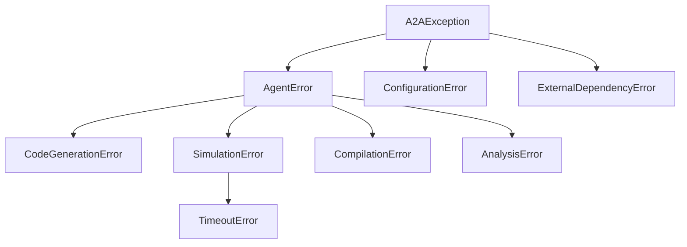

# 🛡️ Error Handling Guide

This document describes the structured error handling system in the A2A Framework.

## Exception Hierarchy

All custom exceptions inherit from `A2AException` (defined in `utils/errors.py`).



### Core Exceptions

| Exception | Description | Raised By |
|-----------|-------------|-----------|
| `A2AException` | Base class for all framework errors | - |
| `ConfigurationError` | Invalid settings or missing environment vars | `config/settings.py` |
| `CodeGenerationError` | LLM failure or invalid response | `agents/coder.py` |
| `CompilationError` | Syntax error or missing imports | `utils/validation.py`, `agents/simulator.py` |
| `SimulationError` | Runtime failure in NS-3 | `agents/simulator.py` |
| `TimeoutError` | Simulation exceeded time limit | `agents/simulator.py` |

## Best Practices

### 1. Raising Exceptions

Always raise specific exceptions rather than generic `Exception`.

```python
from utils.errors import CodeGenerationError

def generate_code(...):
    try:
        # ...
    except Exception as e:
        raise CodeGenerationError(f"LLM failed: {e}")
```

### 2. Handling Exceptions

Agents should let exceptions propagate to the Supervisor or handle them if they can recover.

**Supervisor Handling:**
The Supervisor (`supervisor.py`) catches `A2AException` at the top level to log the error and update the system status safely.

### 3. Validation

Use `utils/validation.py` to prevent errors before they happen.

```python
from utils.validation import validate_code

is_valid, msg = validate_code(code)
if not is_valid:
    # Handle validation error
```
